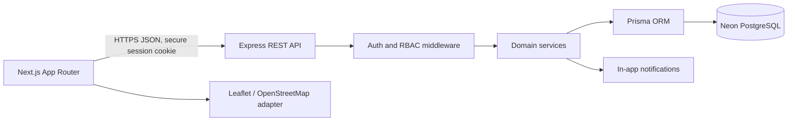
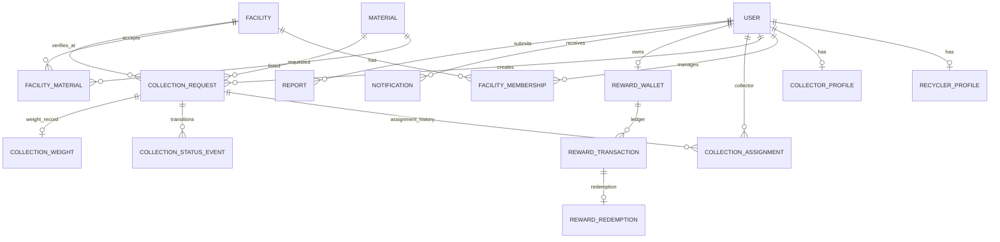

# Recycling & Waste Drop-Off Locator: Architecture and Staged MVP Prompt

## Purpose

Use the supplied master specification as the product target for evolving WasteWise into a multi-role collection and rewards platform. Deliver it incrementally as a tested MVP; do not claim production-ready security, live tracking, or external-service integration until those parts are implemented and verified.

## Current repository baseline

- `client/`: Next.js 16 App Router, React 19, TypeScript, Tailwind CSS, Leaflet/React Leaflet.
- `server/`: Express 5 running CommonJS JavaScript with a single sample route; `pg`, bcrypt, JWT, dotenv and CORS packages are present, but there is no configured Prisma schema, database, or role auth.
- Existing user interface uses the Figma-derived green tokens in `client/app/globals.css` and Nunito/Inter fonts in `client/app/layout.tsx`.
- Existing map uses Leaflet/OpenStreetMap and sample Gauteng facilities.
- Preserve current UI colors and typography. Do not re-theme or replace the UI visual system while adding product flows.
- Keep existing `client/` and `server/` directories; do not perform a disruptive rename to `frontend/` and `backend/`.

## System architecture



- **Frontend:** Next.js owns role-specific, responsive screens and calls the API through a typed client. Do not put secrets in `NEXT_PUBLIC_*`. Use route guards for experience only; the API remains the authorization authority.
- **Backend:** Express owns identity, authorization, validation, state transitions, collector allocation suggestions, verification and reward accounting. Controllers stay thin; business rules live in services.
- **Data:** Neon PostgreSQL is the system of record. Prisma schema and migrations define the contract; seed only demo-safe sample records.
- **Maps:** keep the current Leaflet/OpenStreetMap adapter for the Gauteng demo. Put geocoding/directions behind a provider interface if a paid provider is later chosen. Browser geolocation is permission-based and optional. Never treat mock/static collector coordinates as live tracking.
- **Notifications:** persist in-app notifications. Push/SMS/email are later providers, not implied by an in-app record.

## Database model / ERD



### Core entities and invariants

- `User`: id, normalized unique email, password hash, role (`RECYCLER`, `COLLECTOR`, `FACILITY`, `ADMIN`), account state, timestamps. Store password hashes only.
- `RecyclerProfile`: user FK and optional display/contact preferences.
- `CollectorProfile`: user FK, approval state, availability (`AVAILABLE`, `UNAVAILABLE`, `ON_COLLECTION`, `OFFLINE`), service-area definition, vehicle information, last reported coordinates and timestamp. Stale coordinates must be marked stale, not presented as current.
- `Facility`: name, address, latitude/longitude, contacts, website, approval state, opening-hour records, timestamps. `FacilityMembership` links authorized facility users to facilities.
- `Material`: canonical name, active flag, configurable points-per-kg rate and rate effective dates. Seed Plastic, Glass, Paper, Metal, E-waste and General Waste; adding a material is data/configuration work, not a schema migration.
- `FacilityMaterial`: facility/material many-to-many relationship plus optional intake notes.
- `CollectionRequest`: requester, selected material, estimated kg, requested time/window, address and coordinates, optional destination facility, current status, cancellation reason, timestamps. Positive weight and coordinate bounds are validated.
- `CollectionAssignment`: append-only assignment/reassignment history with collector, assigning admin, assigned/unassigned times and reason. Only one active assignment is allowed per request.
- `CollectionStatusEvent`: append-only from/to status, actor, timestamp, optional note. The current status is also stored on the request for efficient reads.
- `CollectionWeight`: estimated kg snapshot, actual kg, recorded by collector, verified kg, verifying facility/user and timestamps. Award calculation uses only verified kg.
- `RewardWallet`: one per recycler, current points balance as an integer, updated transactionally with ledger entries.
- `RewardTransaction`: immutable ledger entry (`EARN`, `REDEEM`, `ADJUSTMENT`), signed integer points, points-to-rand rate snapshot, source request/redemption, actor, timestamp, idempotency key. Do not derive balance by trusting client input.
- `RewardRedemption`: requested reward tier, points, rand-value snapshot, unique reference, status and created/fulfilled timestamps.
- `Notification`: recipient, type, safe metadata, read timestamp and creation timestamp. Exclude precise collection coordinates except for explicitly authorized recipients.
- `Report`: reporter, target facility or suggested-location fields, description/type, review status and timestamps.
- All mutable domain records get `createdAt` and `updatedAt`; audit/event records are append-only.

### Reward invariant

`randValue = points * 0.20`. Store points as integers and use decimal-safe currency representation (integer cents or Prisma Decimal), never binary floating-point for persisted money. `points = floor(verifiedKg * effectivePointsPerKg)` using an explicitly documented rounding rule. In one database transaction, mark verification, create the ledger entry with a unique source/idempotency key, and update wallet balance. Estimated weight never earns points. Redemption locks/checks the wallet in a transaction, rejects insufficient balance, debits once, records a redemption and returns a unique reference.

## User roles and data access

| Capability | Recycler | Collector | Facility member | Admin |
|---|---|---|---|---|
| Browse approved facilities/materials | Read | Read | Read | Read/write |
| Own profile | Read/update own | Read/update own | Read/update own membership profile | Manage/suspend |
| Create/view collection request | Create and read own | Read assigned only | Read deliveries assigned to own facility | Read all |
| Exact pickup coordinates | Own request | Only while actively assigned and authorized | Only when needed for facility verification/delivery | Authorized operations |
| Accept/reassign collector | No | Accept/decline own assignment | No | Assign/reassign manually |
| Update journey status/actual weight | Confirm receipt where applicable | Own active assignment only | Verify delivered material/weight | Resolve/override with audit |
| Wallet/redeem rewards | Own wallet only | No recycler wallet access | No recycler wallet access | Configure rates and audit ledger |
| Approve collector/facility | No | No | No | Yes |

- Enforce every row/object check in API services/middleware; hiding a button is not authorization.
- A collector sees a request's precise address only after an active assignment. Unassigned collectors receive neither coordinates nor exact address in list, map, notifications, logs or API errors.
- A facility sees only deliveries associated with a facility it is authorized to manage. Admin actions that affect assignments, verification, rates or accounts are audited.

## Collection workflow and state machine

Canonical states: `PENDING` → `WAITING_FOR_ADMIN` → `COLLECTOR_ASSIGNED` → `COLLECTOR_ON_THE_WAY` → `COLLECTOR_ARRIVED` → `COLLECTED` → `VERIFICATION_PENDING` → `VERIFIED` → `COMPLETED`; terminal alternatives `CANCELLED`, `REJECTED`.

1. Recycler selects material, estimated kg, address/coordinates and preferred date/time. Validate and persist request as `WAITING_FOR_ADMIN` (or `PENDING` immediately followed by the explicit waiting transition in the same transaction).
2. Admin queue shows the request and candidate collectors. Server ranks only approved, available, service-area-compatible collectors; ranking considers distance and active workload. Distance is approximate straight-line Haversine unless routing is explicitly integrated. ETA must be labelled an estimate; do not promise road travel time without a routing provider.
3. Admin manually chooses Assign. Assignment and status event are persisted atomically. Only that collector receives exact pickup coordinates and address.
4. Assigned collector accepts, then may transition to on-the-way and arrived. Each transition is actor- and state-checked and produces an event/notification.
5. Collector records actual kg and marks collected. Facility member verifies actual accepted kg/material; request becomes verified. The reward service calculates and awards points idempotently only at verification.
6. Request becomes completed once required verification/reward ledger work is durable. User can cancel only in allowed pre-collection states; every cancellation/rejection needs an actor and reason.
7. Tracking displays last update time, assignment status, approximate distance/ETA only where data is sufficiently fresh. Without a live location provider, show the last known update and clearly label demo/static data.

## REST API plan

Prefix `/api/v1`. JSON response and validation conventions are shared; use correct status codes and a consistent `{ data }` / `{ error: { code, message, details? } }` envelope.

### Authentication and profiles

- `POST /auth/register` — prototype-safe recycler registration in MVP; role-specific registration only after approval workflows exist.
- `POST /auth/login`, `POST /auth/logout`, `GET /auth/session` — secure server-set session cookie; refresh/rotation and revocation are designed before production exposure.
- `GET /users/me`, `PATCH /users/me` — authenticated own profile.

### Facilities and materials

- `GET /materials`, `GET /facilities?query=&material=&lat=&lng=&radiusKm=&openNow=`
- `GET /facilities/:facilityId`
- `POST /facilities`, `PATCH /facilities/:facilityId` — facility/admin only; approvals gate public visibility.
- `POST /reports`, `GET /admin/reports`, `PATCH /admin/reports/:reportId` — submit/review location reports.

### Collections

- `POST /collections` — recycler creates own request.
- `GET /collections/mine`, `GET /collections/:collectionId`, `POST /collections/:collectionId/cancel` — ownership checked.
- `GET /admin/collections?status=`, `GET /admin/collections/:collectionId/candidates`, `POST /admin/collections/:collectionId/assign` — admin-only manual allocation and reassignment.
- `GET /collector/collections`, `POST /collector/collections/:collectionId/accept`, `PATCH /collector/collections/:collectionId/status`, `POST /collector/collections/:collectionId/weight` — assigned collector only.
- `POST /facilities/:facilityId/collections/:collectionId/verify` — authorized facility member/admin only; idempotently verifies weight and awards points.

### Rewards and notifications

- `GET /rewards/wallet`, `GET /rewards/transactions`, `GET /rewards/redemptions`, `POST /rewards/redemptions` — own recycler only.
- `GET /admin/reward-rates`, `PUT /admin/reward-rates/:materialId` — admin-only, versioned/effective-dated rates.
- `GET /notifications`, `PATCH /notifications/:notificationId/read` — recipient-only.

No endpoint accepts caller-provided role, points balance, rand conversion, assignment actor, or verified weight as trusted authority.

## Frontend page and component structure

Preserve the existing green UI colors, Nunito/Inter type and Figma-derived visual language. Adapt `client/app/page.tsx` into route-level screens incrementally; do not redesign colors during feature work.

- Shared: authenticated app shell, accessible role-aware navigation, typed API client, session/loading/error states, facility card, material picker, map, status timeline, notification list, empty states.
- Public/auth: landing, login, recycler registration; collector/facility onboarding can be introduced with pending approval state.
- Recycler: dashboard; find facilities/list-map toggle; facility details; request-collection wizard (material/weight → location → date/time → review); request tracking; history; wallet/transactions/redemptions; impact summary; saved facilities; notifications/profile.
- Collector: application/profile; availability; assigned queue; assignment detail/map; status and actual-weight form; history.
- Facility: profile/materials/hours editor; incoming deliveries; verification queue and history/statistics.
- Admin: overview counts; pending role approvals; request queue and collector candidates/map; manual assignment/reassignment; active/completed request monitor; verification/reports/reward-rate management.
- Every role dashboard has loading, empty, error, unauthorized and success states. Role-specific routes are backed by API authorization.

## Recommended repository structure

Evolve current folders rather than renaming:

```text
client/
  app/                    # Next.js routes and layouts
  components/             # shared UI and domain components
  lib/api/                # typed fetch client and response types
  lib/auth/               # session and route helpers (not authorization authority)
  features/               # recycler, collector, facility, admin feature UI
  types/
server/
  src/
    app.ts
    server.ts
    routes/
    controllers/
    middleware/            # session, role, validation, error handler
    services/              # collections, allocation, rewards, facilities
    repositories/
    schemas/                # request validation
    utils/                  # geo distance and shared helpers
  prisma/
    schema.prisma
    migrations/
    seed.ts
  tests/
.env.example
```

Incrementally convert `server/index.js` to TypeScript only when the first backend vertical slice is approved. Keep `DATABASE_URL`, auth secrets and provider credentials server-only. `.env.example` contains names/placeholders, never real values.

## Staged implementation order

1. **Architecture and contract:** approve this model, API envelope, status/state rules and privacy boundary. Record only stable contracts in project docs.
2. **MVP backend foundation:** establish Express TypeScript structure, validation/error conventions, Prisma/Neon configuration and safe `.env.example`; migration and seed setup; preserve Next/Express run commands. Do not require live secrets to build/lint.
3. **Auth/RBAC vertical slice:** recycler registration/login/session, password hashing, secure cookie and protected own-profile route; role tests. Collector/facility/admin lifecycle remains gated until approval workflows are ready.
4. **Facilities integration:** Prisma-backed approved facility/material reads; connect current search, South African map, details and reports to the API; preserve palette and fallback/error states.
5. **Collection MVP:** request wizard, persistence, recycler request history/status; admin queue and manual assignment; collector assigned queue/status/actual kg with ownership and privacy rules.
6. **Verification and rewards:** facility verification, transactional/idempotent verified-weight award, wallet ledger and redemption with insufficient-balance tests; make points/kg admin-configurable.
7. **Role dashboards and notifications:** collector/facility/admin workflows and in-app notifications, delivered by role and privacy policy.
8. **Location tracking and polish:** add provider-backed geocoding/routing/live updates only after provider, cost, consent, retention, stale-location and security decisions. Test desktop/mobile/accessibility and end-to-end transitions.

Each stage is a separately reviewable vertical slice. Do not implement all roles, database, live tracking and rewards as one untestable burst. Do not describe mock values as connected services.

## UI constraint

**Do not change UI colors.** Keep the existing background, foreground, green primary shades, status palette and typography from `client/app/globals.css` and `client/app/layout.tsx`. Add layout/components using these existing tokens; if a new state needs color, use the existing semantic palette and maintain accessible contrast.

## Approval and execution gate

Before implementation, confirm the architecture and staged scope with the project owner. After approval, implement only the first agreed stage, run its focused lint/build/tests, report changed files and exact manual checks, then request continuation for the next major phase. Existing `.env`, Figma source and unrelated user edits must remain untouched.
